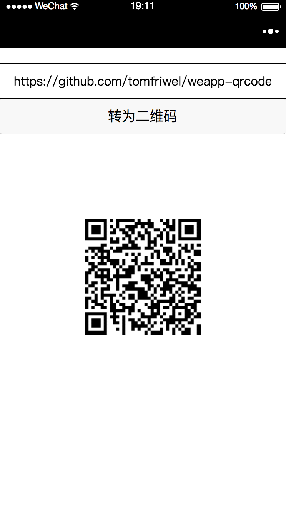
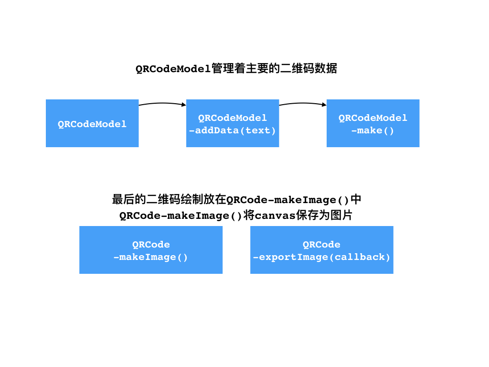

# weapp-qrcode
微信小程序 生成二维码工具

> 生成二维码数据的主要代码来自[davidshimjs/qrcodejs](https://github.com/davidshimjs/qrcodejs)，因为它这个里面生成二维码图片的功能在微信小程序里不能使用，我将这个功能改写成可以在微信小程序中使用。

## 截图
  
 

## 使用

页面`js`中引入:
```
var QRCode = require('../../utils/weapp-qrcode.js')
```

页面加载好后:
```
var qrcode = new QRCode('canvas', {
    text: "https://github.com/tomfriwel/weapp-qrcode",
    width: 150,
    height: 150,
    colorDark: "#000000",
    colorLight: "#ffffff",
    correctLevel: QRCode.CorrectLevel.H,
});
```
`text`为需要转化为二维码的字符串；

`width`和`height`为绘制出的二维码长宽，这里设置为跟`canvas`同样的长宽；

`colorDark`和`colorLight`为二维码交替的两种颜色；

`correctLevel`没有细看源码，命名上看应该是准确度；

如果需要再次生成二维码，调用`qrcode.makeCode('text you want convert')`。

## 主要流程

 