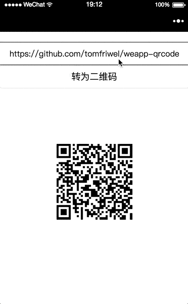
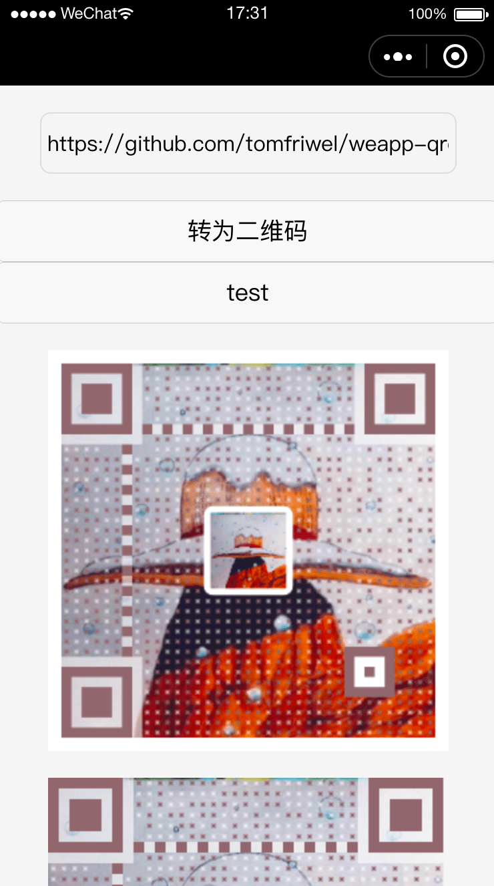
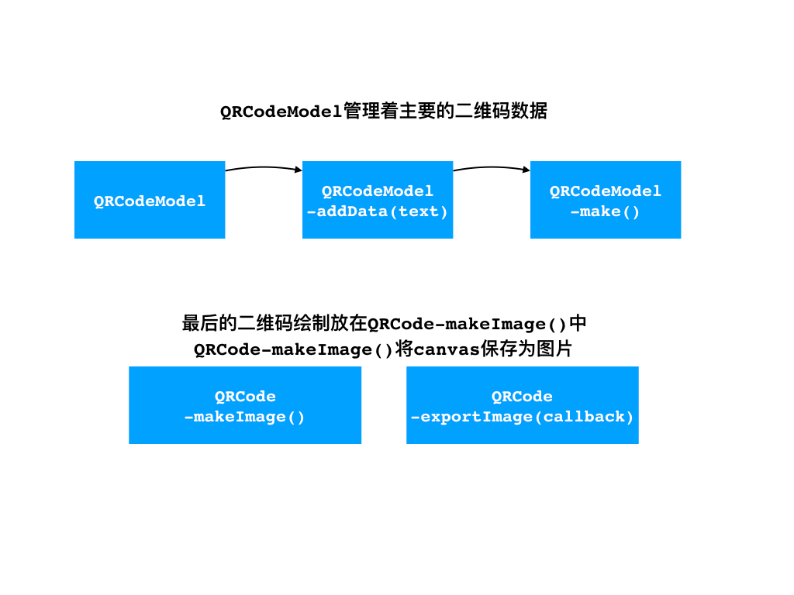

# weapp-qrcode
微信小程序生成二维码工具    

> 生成二维码数据的主要代码来自[davidshimjs/qrcodejs](https://github.com/davidshimjs/qrcodejs)，因为它这个里面生成二维码图片的功能在微信小程序里不能使用，我将这个功能改写成可以在微信小程序中使用。

## 截图




## 背景图测试中...（页面`pages/test/test`）


## 使用（自适应版本，使用`rpx`为单位）

完整代码请参考`pages/responsive/responsive`，设置`width`和`height`的时候稍微所有不同。

`canvas`的长宽通过计算获得
```js
const QRCode = require('../../utils/weapp-qrcode.js')
import rpx2px from '../../utils/rpx2px.js'
let qrcode;

// 300rpx 在6s上为 150px
const qrcodeWidth = rpx2px(300)

Page({
    data: {
        ...
        qrcodeWidth: qrcodeWidth,
        ...
    },
    onLoad: function (options) {
        qrcode = new QRCode('canvas', {
            // usingIn: this,
            text: "https://github.com/tomfriwel/weapp-qrcode",
            image: '/images/bg.jpg',
            width: qrcodeWidth,
            height: qrcodeWidth,
            colorDark: "#1CA4FC",
            colorLight: "white",
            correctLevel: QRCode.CorrectLevel.H,
        });
    },
    ...
})
```

`wxml`页面中：
```html
<canvas class='canvas' style="width:{{qrcodeWidth}}px; height:{{qrcodeWidth}}px;" canvas-id='canvas' bindlongtap='save'></canvas>
```

`wxss`中的`canvas`样式不再设置长宽。这样后就达到了自适应的效果，可以在不同设备上进行查看。

## 使用（非自适应）

完整代码请参考`pages/index/index`

页面`wxml`中放置绘制二维码的`canvas`:
```
<canvas class='canvas' canvas-id='canvas' bindlongtap='save'></canvas>
```

页面`js`中引入:
```
var QRCode = require('../../utils/weapp-qrcode.js')
```

页面加载好后:
```js
//传入wxml中二维码canvas的canvas-id
//单位为px
var qrcode = new QRCode('canvas', {
    // usingIn: this,
    text: "https://github.com/tomfriwel/weapp-qrcode",
    width: 150,
    height: 150,
    colorDark: "#000000",
    colorLight: "#ffffff",
    correctLevel: QRCode.CorrectLevel.H,
});
```

`usingIn`为可选参数，详情清查卡[在自定义组件使用时失效及解决思路 #1](https://github.com/tomfriwel/weapp-qrcode/issues/1)

`text`为需要转化为二维码的字符串；

`width`和`height`为绘制出的二维码长宽，这里设置为跟`canvas`同样的长宽；

`colorDark`和`colorLight`为二维码交替的两种颜色；

`correctLevel`没有细看源码，命名上看应该是准确度；

如果需要再次生成二维码，调用`qrcode.makeCode('text you want convert')`。

`wxss`里需要设置同等的长宽，比如上面初始化时的长宽为`150`，那么：
```
.canvas {
    //...
    width: 150px;
    height: 150px;
}
```

## 主要流程



## TODO

* https://github.com/SumiMakito/Awesome-qr.js
